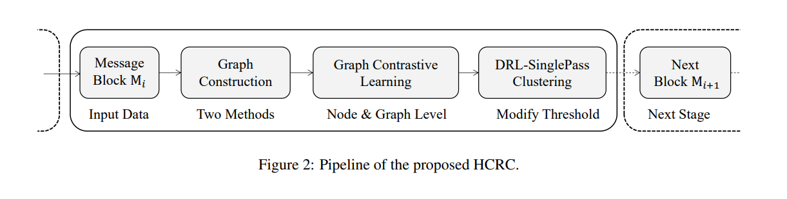

# Task 1 - Event Detection

## Emmbedding + Online Clustering 
### **Paper 1.  Embed2Detect: Temporally Clustered Embedded Words for Event Detection in Social Media**
* Summary: 
the aim of the system described in this paper is, given a filtered data stream, identifying event occurred time windows in (near) real-time including the corresponding event-related words. Using the hyper-parameters, users are allowed to set the significance and update rate of interested events


* Abstrract :

- Social media is becoming a primary medium to discuss what is happening around the world. 
- Apart from a few notable exceptions, most previous research on automated event detection have focused only on statistical and syntactical features in data and lacked the involvement of underlying semantics which are important for effective information retrieval from text since they represent the connections between words and their meanings. 
- In this paper, we propose a novel method termed Embed2Detect for event detection in social media by combining the characteristics in word embeddings and hierarchical agglomerative clustering. 
- The adoption of word embeddings gives Embed2Detect the capability to incorporate powerful semantical features into event detection and overcome a major limitation inherent in previous approaches.
- We experimented our method on two recent real social media data sets which represent the sports and political domain and also compared the results to several state-of-the-art methods. 
- The obtained results show that Embed2Detect is capable of effective and efficient event detection and it outperforms the recent event detection methods. 
- For the sports data set, Embed2Detect achieved 27% higher F-measure than the best-performed baseline.
- For the political data set, it was an increase of 29%.

* Methodology
The main novelty of this approach is the involvement of corpus oriented semantical features for event detection using self-learned word embeddings.
Further, the temporal variations between clusters and vocabularies are considered to identify events without relying on clusters directly.
The Embed2Detect system contains four main components:
    (1) stream chunker, 
    (2) word embedding learner, 
    (3) event window identifier,
    (4) event word extractor.
Self-learned word embeddings are used during event window identification and event word extraction phases.
In order to evaluate the performance of this approach, event mapper is used to map detected events with ground truth events during experiments.
* Datasets Used  
    1. MUNLIV
* Citation 
    ```
        Hettiarachchi, Hansi, Mariam Adedoyin-Olowe, Jagdev Bhogal, and Mohamed Medhat Gaber. 2022. “Embed2Detect: Temporally Clustered Embedded Words for Event Detection in Social Media.” Machine Learning 111(1): 49–87. doi:10.1007/s10994-021-05988-7.

    ```

## Graph Neural Network Based Approaches 
### Paper 1.  Deep-Eware: Spatio-Temporal Social Event Detection Using a Hybrid Learning Model
* Summary 
* Methodology
* General Architecture
* Datasets Used 
* Citation 
    ```
    Afyouni, Imad, Aamir Khan, and Zaher Al Aghbari. 2022. “Deep-Eware: Spatio-Temporal Social Event Detection Using a Hybrid Learning Model.” Journal of Big Data 9(1): 86. doi:10.1186/s40537-022-00636-w.


    ```
### Paper 1.  Hierarchical and Incremental Structural Entropy Minimization for Unsupervised Social Event Detection
* Summary 
* Problem Formalisation

    Given a sequence of social messages $S_{streame} = m_1, ..., m_N$ as input,
    the task of social event detection can be fulfilled by constructing and partitioning a message graph $G = (V, E)$.

    The node set $V = {m_1, ..., m_N }$. 
    
    The edge set $E$ is initially empty and to be expanded by the message graph construction process. 
   
    Partitioning G results in $ \{e_1, ..., e_M\}, ei ⊂ V, ei ∩ ej = ∅$,
    which is a partition of V containing M clusters (sets) of messages that correspond to the M detected
social events.

* Methodology
* General Architecture
* Datasets Used 
* Citation 
    ```
    Cao, Yuwei, Hao Peng, Zhengtao Yu, and Philip S. Yu. 2023. “Hierarchical and Incremental Structural Entropy Minimization for Unsupervised Social Event Detection.” doi:10.48550/arXiv.2312.11891.

    ```
### Paper 2.  Unsupervised Social Event Detection via Hybrid Graph Contrastive Learning and Reinforced Incremental Clustering
* Summary 

 The innate challenge for detecting events is to extract discriminative information from social media data thereby assigning the data into different events. 

 To this end, recent works explore learning discriminative information from social messages by leveraging graph contrastive learning (GCL) and embedding clustering in an unsupervised manner. 
 However, two intrinsic issues exist in benchmark methods: 

1. conventional GCL can only roughly explore partial attributes, thereby insufficiently learning the discriminative information of social messages
 
2. for benchmark methods, the learned embeddings are clustered in the latent space by taking advantage of certain specific prior knowledge, which conflicts with the principle of unsupervised learning paradigm.

 
 In this paper:

1.  they propose a novel unsupervised social media event detection method via hybrid graph contrastive learning and reinforced incremental clustering (HCRC)
2. which uses hybrid graph contrastive learning to comprehensively learn semantic and structural discriminative information from social messages, 
3. reinforced incremental clustering to perform efficient clustering in a solidly unsupervised manner. 

They conduct comprehensive experiments to evaluate HCRC on the Twitter and Maven datasets. The experimental results demonstrate
that our approach yields consistent significant performance boosts. 

* Methodology

* General Architecture
* Problem Formalisation

The social stream is a continuous sequence of messages. $M_i$ denotes a message block containing all the messages during a certain time period and $M_i = \{ m_j|1 ≤ j ≤ |Mi|\}$ , where  $m_j$ is a specific message. As shown in Fig. 3, given a message block $M_i$, a social event detection model aims to find clusters and each cluster denotes a real-world event containing a set of correlated social messages. Further, an incremental social event detection model detects events from continuous message blocks, which adds newly arrived messages to previous events or generates new event clusters successively.

* Methodology

When a message block $M_i$ is received, the pipeline illustrated in Fig below  is employed. Two different approaches are utilized
to construct graphs, and node-level and graph-level contrastive learning is conducted to obtain the hybrid social message representation. Then, DRL-SinglePass clustering is used to compute the state based on the clusters of the block, and reinforcement learning is employed to learn an appropriate threshold . The learned threshold is applied to SinglePass clustering to cluster the current message block $M_i$ and obtain predicted labels, which are compared with the ground-truth labels to derive clustering results.



* General Architecture
 


* Datasets Used 
    1. Events 2012 
    2. MAVEN
* Citation 
    ```
    Guo, Yuanyuan, Zehua Zang, Hang Gao, Xiao Xu, Rui Wang, Lixiang Liu, and Jiangmeng Li. 2024. “Unsupervised Social Event Detection via Hybrid Graph Contrastive Learning and Reinforced Incremental Clustering.” Knowledge-Based Systems 284: 111225. doi:10.1016/j.knosys.2023.111225.


    ```

### Paper 3. Towards Cross-lingual Social Event Detection with Hybrid Knowledge Distillation
* Summary 
- Recently published graph neural networks (GNNs) show promising performance at social event detection tasks.
- most studies are oriented toward monolingual data in languages with abundant training samples.
- This has left the commo lesser-spoken languages relatively unexplored. 
- this work, they present a GNN-based framework that integrates cross-lingual word embeddings into the process of graph knowledge distillation for detecting events in low-resource language data streams.
- To achieve this, a novel cross-lingual knowledge distillation framework, called CLKD, exploits prior knowledge learned from similar threads in English to make up for the paucity of annotated data.
- to extract sufficient useful knowledge, they propose a hybrid distillation method that consists of both feature-wise and relation-wise information. 
- To transfer both kinds of knowledge in an effective way, they add a cross-lingual module in the feature-wise distillation to eliminate the language gap and selectively choose beneficial relations in the relation-wise distillation to avoid distraction caused by teachers’ misjudgments.

* Methodology

* General Architecture
* Problem Formalisation

* Methodology


* General Architecture


* Datasets Used 
    1. Events 2012 
    2. Events 2018
    3. Kawarith
* Citation 
    ```


    ```
